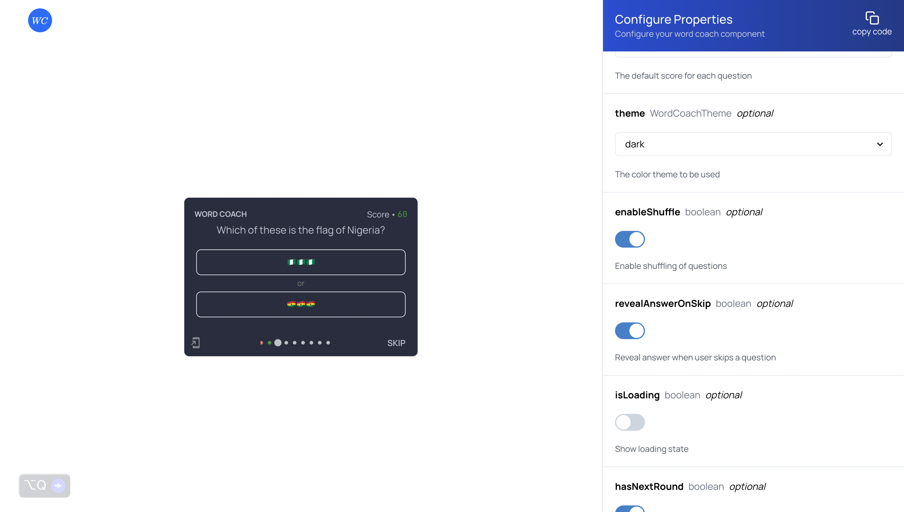

<p align="center">
  <br />
  <br />
  <br />
  
  <br />
  <br />
  <h3 align="center">A quiz component</h3>

  <p align="center">
  <a href="https://npm.im/dropd-component"></a>
  <a href="http://makeapullrequest.com"></a>
  <a href="http://www.firsttimersonly.com"></a>
  </p>
</p>

<p align="center">
  <a aria-label="NPM version" href="https://www.npmjs.com/package/next">
    
  </a>
  <a aria-label="License" href="https://github.com/vercel/next.js/blob/canary/license.md">
    
  </a>

</p>

Word Coach is simply a replica of the
[Google word coach](https://www.seoexpertindelhi.in/google-word-coach/) built in
React. You can see the orginal Google Word coach in action by searching "Google
Word coach" on Google via **your mobile device**. This project may only be used
for learning purposes as the initial idea is from Google.

## Demo

I've built an interactived demo to help you see the comp



[Go to Demo](https://wordcoach.xyz)

## Installation

```bash
yarn add @word-coah/react
```

## Contributing

See [Contributing](#contributing)

## 📝 License

Licensed under the
[MIT License](https://github.com/marvinjude/word-coach/license.md)

## Todo

### All

### @word-coach/react

<!-- Before relase -->
- [x] Use streamed data over fake data
- [x] add onChunk callback
- [x] Prevent highlight overflow
- [x] Introduce modes ["stream|static"]
- [x] Prevent moving or skipping if next chunk hasn't arrived, move to next when
      data arrives
- [x] Cleanup themes - Make sure all themes looks nice
- [x] Fix EndGameScreen
- [x] Fetch again on "Next Round" for stream mode
- [x] In stream mode: sometimes the data is fetch but can't proceed to next
      question
- [x] Fully wire props with UI
- [x] Inject link preload to document to load images ahead of time
- [ ] ❌ Back state up in localStorage - hydation issues happening
- [ ] General code cleanup
- [ ] Write test with playright
- [ ] TS type for css & svg
- [ ] Ship to NPM
- [ ] Deploy same in-react example to codesandbox(setup pipline for that)
- [ ] Switch styling solution
- [ ] Docs

<!-- After relase -->
### @word-coach/ai-questions

<!-- Before relase -->
- [x] Fix CSV parsing in Library
- [x] image fetching may messs with order of question index in stream
- [ ] Write tests
- [ ] Docs
- [ ] Add "why answer"

<!-- After relase -->

### wordcoach.xyz(Not yet released)
- [x] Build UI for mode and render based on props based on mod
- [x] Build UI for progress
- [x] Copy Code Feature
- [ ] Open on CodeSandbox
- [ ] Block Requests not coming from wordcoach.xyz
- [ ] Incoporate modes
- [ ] Show stream progress in stream mode
- [ ] Debounce stremEndPoint input element
- [ ] Add Sentry to Catch Errors in Production
- [ ] Switch to ShadcnUI/Radix UI

<!-- After relase -->
